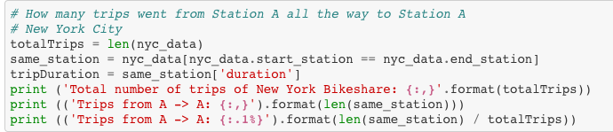

# Same Station Visualization

I then continued with data visualization. At this time, I tried to figure out the way to find the number of all the trips from Station A all the long way to Station A and the percentage of these trips over the total trips. Therefore, I will sort all the data that start_station is the same as end_station. And then I calculate the the total trips and take same station trips divide the total trips. Here below is my code to answer the question:

After calculating the total accidental checkouts of both cities, I get the result that trips from A to A in New York City are 137,027 trips (2.5 %) and trips from A to A in Boston are 76,311 (4.8%). These percentages are quite high to me.