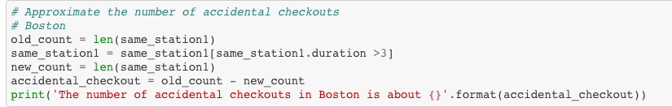

# Accidental Checkouts Question

Today, I did some data visualization to explore how many accidental checkouts are in both New York City and Boston. I tried to figure out what are the accidental checkouts and how can we calculate the total accidental checkouts. After plotting the trip duration distribution, I realized that there were lots of trip with durations less than 3 minutes. Therefore, I decided that all the trips less than 3 minutes were regarded as accidental checkouts. Here below is my code to calculate the total accidental checkouts of New York City and Boston and the percentages of all the accidental checkouts:

After that, I calculated that there are 32668 accidental checkouts in New York and there are 4751 accidental checkouts in Boston. We then tried to drop all the accidental checkouts and see new distributions of trip duration in both cities, but the distributions are not too different.
